# 🚀 Dev_Project

¡Bienvenido a Dev_Project (Proyecto de evaluacion Kelvin D. Alcala Grassal)! 👋  
Este proyecto es un ejemplo práctico que combina **Docker**, **Terraform**, **AKS**, **Azure Pipelines** y **Node JS** para levantar una aplicación de manera eficiente y ordenada.

## Notas importantes
- Se recomienda crear la infraestructura en un repositorio separado a las fuentes de la aplicacion.
- Por motivo de la evaluacion vigente en esta practica se crean los ambientes desde Cero incluyendo el kluster de AKS (Caso que no debe hacerse en produccion).

## Main

[](https://dev.azure.com/the-punisher01/gitops/_build/latest?definitionId=46&branchName=main)

## Develop
[](https://dev.azure.com/the-punisher01/gitops/_build/latest?definitionId=46&branchName=develop)

## SonarCloud 
[](https://sonarcloud.io/summary/new_code?id=silencfox_Dev_Project)


[](https://sonarcloud.io/summary/new_code?id=silencfox_Dev_Project)

[](https://sonarcloud.io/summary/new_code?id=silencfox_Dev_Project)

[](https://sonarcloud.io/summary/new_code?id=silencfox_Dev_Project)

[](https://sonarcloud.io/summary/new_code?id=silencfox_Dev_Project)

[](https://sonarcloud.io/summary/new_code?id=silencfox_Dev_Project)

[](https://sonarcloud.io/summary/new_code?id=silencfox_Dev_Project)

[](https://sonarcloud.io/summary/new_code?id=silencfox_Dev_Project)

[](https://sonarcloud.io/summary/new_code?id=silencfox_Dev_Project)

[](https://sonarcloud.io/summary/new_code?id=silencfox_Dev_Project)

[](https://sonarcloud.io/summary/new_code?id=silencfox_Dev_Project)


## 📦 ¿Qué hay dentro?

- `app/` ➡️ Código de la aplicación Node.js 🍃
- `deployment/` ➡️ Archivos para desplegar la app.
- `infra/` ➡️ Scripts de infraestructura como código (IaC) usando Terraform.
- `nginx/` ➡️ Configuración de NGINX como proxy inverso "para reverse proxy (no en uso)".
- `pipeline/` ➡️ Definiciones para CI/CD.
- `tfstate/` ➡️ Archivos de estado remoto de Terraform.

## 🛠️ Tecnologías principales

- **Docker** 🐳
- **Terraform** ☁️
- **Azure DevOps Pipelines** 🔵
- **Azure Kubernetes Services ** 🌐
- **Node.js** ⚡

## 🚀 Cómo ejecutar el proyecto


## ⚡ ¿Cómo se dispara el despliegue después de hacer cambios en GitHub?

Cada vez que haces un **push** o creas un **pull request** en GitHub, se activa automáticamente un **pipeline de Azure DevOps**.

Este pipeline se encarga de:

1. Construir la aplicación si es necesario.
2. Aplicar cambios en la infraestructura usando Terraform.
3. Actualizar la configuración de NGINX si aplica.

Así garantizamos que todo cambio en el código o infraestructura se despliegue de forma controlada y automática 🚀.

---

## 🔧 Variables utilizadas en las plantillas de Terraform

Las plantillas de Terraform (`*.tf`) utilizan variables para parametrizar el despliegue. Estas son algunas de las principales:

- **Nombre de recursos:**
  - `resource_group_name`
  - `app_service_name`
  - `plan_name`

- **Región y configuración de Azure:**
  - `location`
  - `sku_tier`
  - `sku_size`

- **Detalles de red (opcional):**
  - `subnet_id`
  - `vnet_name`

- **Autenticación de Azure (variables de entorno necesarias):**
  - `ARM_CLIENT_ID`
  - `ARM_CLIENT_SECRET`
  - `ARM_SUBSCRIPTION_ID`
  - `ARM_TENANT_ID`

**Nota:** Variables ARM* se colocan como variables secretas en azure pipeline antes de ejecutar Terraform.

- **Service connections de Azure **
  - `GitHub`
  - `SonarCloud`
  - `Azure Subscripcion`

## 🔥 Flujo de trabajo de despliegue

```mermaid
graph TD;
    A[GitHub - Push/Pull Request] --> B[Azure DevOps - CI]
    B --> E[Análisis de código ,SonarQube, etc.,]
    B --> F[Pruebas unitarias]
    B --> G[Build de la app]
    G --> H{¿Build y pruebas exitosas?}
    H -- No --> I[Pipeline Falla ❌]
    H -- Sí --> J[Creación de imagen Docker]
    J --> K[Publicar imagen en Azure Container Registry ,ACR,]
    K --> L[Azure DevOps - CD]
    L --> M[Terraform despliega Infraestructura en Azure]
    M --> N[Terraform guarda estados en Azure Blob Storage]
    N --> O[Azure DevOps despliega App en AKS usando imagen de ACR]
    O --> P[Pruebas Funcionales ,Newman,]
    P --> Q{¿Pruebas exitosas?}
    Q -- No --> R[Rollback]
    Q -- Sí --> S[Solicitar aprobación para siguiente Stage]
    S --> T[Aplicación desplegada 🚀]




```





```bash


## 📃 Licencia

Create By Kelvin D. Alcala 

Este proyecto está licenciado bajo la **GNU General Public License v3.0 (GPL-3.0)**.  
Esto significa que:

- Puedes usar, estudiar, compartir y modificar el proyecto libremente.
- Si distribuyes una versión modificada, debes hacerlo bajo la misma licencia GPL-3.0.
- Es necesario incluir una copia de esta licencia junto con el código.

Para más detalles completos, puedes leer la licencia aquí:  
👉 [Licencia GPL-3.0 completa](https://www.gnu.org/licenses/gpl-3.0.html)
